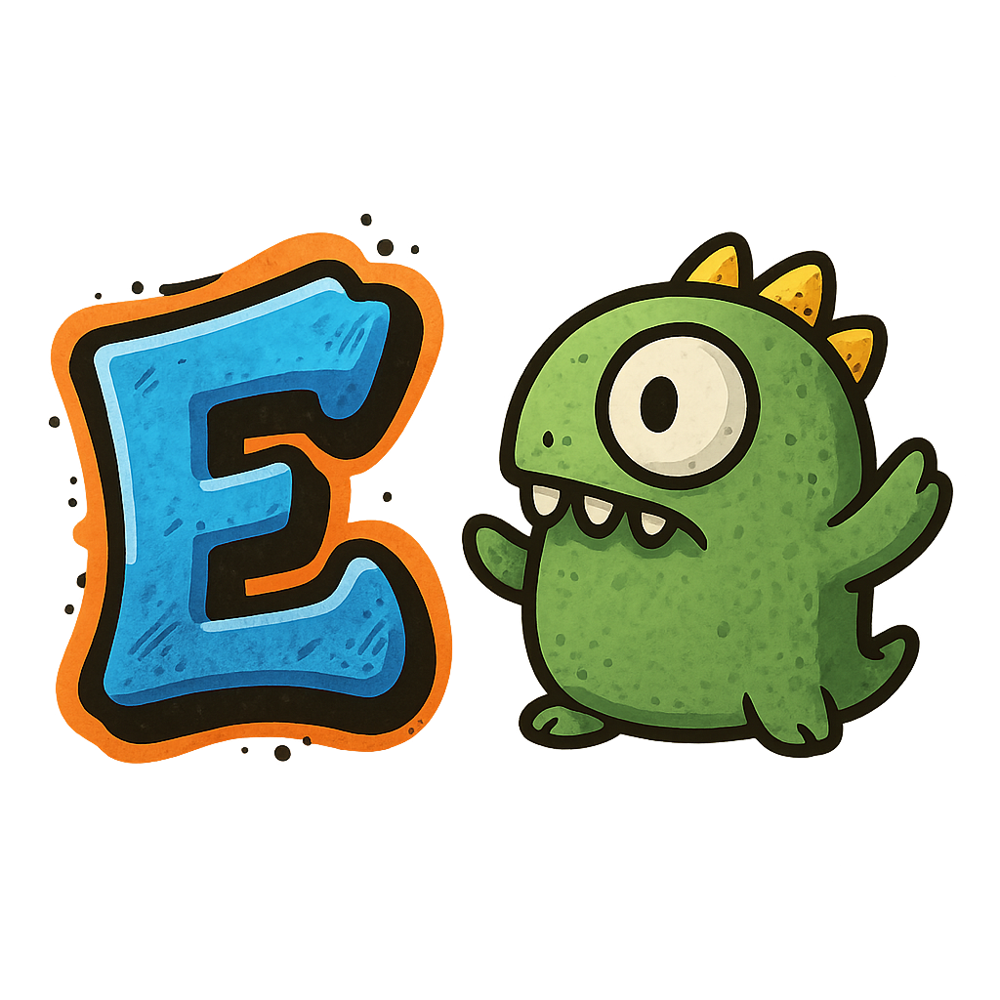

# EgoLang

<div align="center">



A strongly-typed programming language with explicit control over visibility and mutability

[](https://github.com/isamytanaka/EgoLang)
[](https://github.com/isamytanaka/EgoLang)
[](https://github.com/isamytanaka/EgoLang/blob/main/LICENSE)
[](https://www.python.org/)
[](https://github.com/isamytanaka/EgoLang/pulls)
[](https://github.com/isamytanaka/EgoLang/README.md)

<br>

[](https://github.com/isamytanaka/EgoLang/stargazers)
[](https://github.com/isamytanaka/EgoLang/network/members)
[](https://github.com/isamytanaka/EgoLang/issues)
[](https://github.com/isamytanaka/EgoLang/releases)
[](https://github.com/isamytanaka/EgoLang)
[](https://github.com/isamytanaka)

<br>

[](https://github.com/isamytanaka/EgoLang/releases)
[](https://github.com/isamytanaka/EgoLang)
[](https://github.com/isamytanaka/EgoLang)
[](https://github.com/isamytanaka/EgoLang)
[](https://github.com/isamytanaka/EgoLang/actions)
[](https://github.com/isamytanaka/EgoLang/actions)

## Support the Developer

[](https://apoia.se/isamytanaka)

If you find this project valuable, consider supporting Isamy Tanaka's work through Apoia.se. Your contribution helps maintain and improve EgoLang and its ecosystem.

</div>

## 📚 Table of Contents

- [Overview](#-overview)
- [Key Features](#-key-features)
- [Development Status](#-development-status)
- [Code Examples](#-code-examples)
- [Paradigm Support](#-paradigm-support)
- [Installation & Usage](#-installation--usage)
- [Current Limitations](#-current-limitations)
- [Repository Statistics](#-repository-statistics)
- [Version History](#-version-history)
- [Contributing](#-contributing)
- [License](#-license)

## 🔍 Overview

EgoLang is a modern programming language designed with a focus on code clarity, data integrity, and explicit intent. By enforcing strict typing and explicit declarations for variable visibility and mutability, EgoLang creates code that is not only more reliable and maintainable but also inherently more secure.

The core philosophy of EgoLang centers around making code behavior predictable and eliminating ambiguities that often lead to bugs in less strict languages. Every declaration clearly communicates the intended scope, modifiability, and data expectations, reducing cognitive load during code review and maintenance.

## ✨ Key Features

| Feature | Description |
|---------|-------------|
| **Explicit Visibility Control** | Every variable and function must declare its visibility scope (`public`, `private`, or `protected`), creating clear boundaries in your codebase |
| **Explicit Mutability** | Variables must be declared as `mutable`, `immutable`, or `const`, preventing unexpected changes to critical values |
| **Strong Static Typing** | Type checking at compile time ensures that values are used consistently throughout your code |
| **JIT Compilation** | EgoLang compiles to optimized Python bytecode, offering good performance while maintaining strong safety guarantees |
| **Comprehensive Error Detection** | Thorough static analysis catches potential issues before execution with clear, actionable error messages |
| **Python Integration** | Seamless Python integration with the `@py:` directive allows leveraging Python's rich ecosystem when needed |
| **OOP Support** | Class declarations, inheritance, and methods for structured and modular code organization |
| **Clear and Consistent Syntax** | Predictable syntax patterns improve readability and make code maintenance simpler |

## 🚧 Development Status

**Important Note:** EgoLang is a basic language still in early development. The current version (2.8.0) represents our initial public releases, and we're actively working to expand its capabilities, improve performance, and add new features.

As a language in its early stages, EgoLang is not yet recommended for production environments or mission-critical applications. We welcome contributors and early adopters who are interested in helping shape the future of this experimental language.

## 📝 Code Examples

### Hello World

```
public immutable string message = "Hello, EgoLang!";
print(message);
```

### Variable Declaration and Manipulation

```
// Declaring variables with different visibility and mutability
public mutable int counter = 10;
private immutable string name = "EgoLang";
protected const float PI = 3.14159;

// Modifying mutable variables
counter = counter + 5;
print(counter);  // Outputs: 15

// Combining variables
public mutable string result = name + " Counter: " + counter;
print(result);  // Outputs: EgoLang Counter: 15
```

### Functions and Classes

```
// Function definition
public function calculateArea(int width, int height) : int {
    return width * height;
}

// Class definition with inheritance
public class Shape {
    protected mutable float area = 0;
    
    public function calculateArea() : float {
        return area;
    }
}

public class Rectangle extends Shape {
    private mutable int width;
    private mutable int height;
    
    public function __init__(int w, int h) {
        width = w;
        height = h;
        area = width * height;
    }
    
    public function getPerimeter() : int {
        return 2 * (width + height);
    }
}

// Using the class
public mutable Rectangle rect = @py: Rectangle(5, 3);
print("Area: " + rect.calculateArea());  // Outputs: Area: 15
print("Perimeter: " + rect.getPerimeter());  // Outputs: Perimeter: 16
```

### Python Integration

```
// Using Python's string methods directly
public mutable string text = "EgoLang is awesome!";
public mutable string upper_text = @py: text.upper();
print(upper_text);  // Outputs: EGOLANG IS AWESOME!

// Using Python's datetime functions
public mutable string current_date = @py: import datetime; datetime.datetime.now().strftime("%Y-%m-%d");
print("Today is: " + current_date);  // Outputs: Today is: 2025-04-03
```

## 🧩 Paradigm Support

EgoLang is designed to support multiple programming paradigms, giving developers flexibility in how they structure their code:

### Object-Oriented Programming (OOP)

EgoLang includes support for OOP concepts:

- **Classes and Objects**: Define custom data types with encapsulated state and behavior
- **Inheritance**: Extend existing classes to create more specialized types
- **Encapsulation**: Control access to class members with visibility modifiers
- **Methods**: Define functions within classes that operate on the class's state

### Functional Programming

While primarily focused on OOP, EgoLang also supports some functional programming concepts:

- **First-class Functions**: Functions can be assigned to variables and passed as arguments
- **Pure Functions**: Create functions without side effects for more predictable code
- **Immutability**: Use `immutable` and `const` declarations to create unchangeable values

### Procedural Programming

For simpler code structures, EgoLang fully supports procedural programming:

- **Sequential Execution**: Code is executed line by line in a predictable order
- **Conditional Logic**: Control flow with if-else statements
- **Loops**: Repeat operations with for and while loops
- **Functions**: Modularize code with reusable function blocks

## 🚀 Installation & Usage

### Prerequisites

- Python 3.8 or higher
- 64-bit operating system

### Installation

1. Clone the repository:
   ```bash
   git clone https://github.com/isamytanaka/EgoLang.git
   cd EgoLang
   ```

2. Install dependencies:
   ```bash
   pip install -r requirements.txt
   ```

### Using the Compiler

1. Navigate to the `src/Ego_compiler` file in your installation
2. Replace the `sample_code` variable with your EgoLang code:

   ```python
   sample_code = """
   public mutable int x = 10;
   public function double(int value) : int {
       return value * 2;
   }
   print(double(x));
   """
   ```

3. Specify your desired output filename:

   ```python
   compiler.compile(sample_code, 'my_program.ego')
   ```

4. Enable debug mode for additional checks (optional):

   ```python
   compiler = EgoJITCompiler(debug=True)
   ```

5. Run the compiler to generate and execute your code

## ⚠️ Current Limitations

As EgoLang is still in early development, it has several limitations:

- **Limited inheritance features**: Advanced features like multiple inheritance or interfaces are not yet available
- **No exception handling**: There's no built-in mechanism for structured error handling (try/catch blocks)
- **Limited standard library**: The language provides only basic built-in functions
- **No generics support**: Parameterized types are not yet implemented
- **Limited concurrency**: No built-in support for threading or parallel execution
- **Early development stage**: The language is still evolving and may undergo significant changes
- **Limited documentation**: Documentation and learning resources are still being developed
- **Small community**: The ecosystem and support community are in the early stages of growth

## 📊 Repository Statistics

<div align="center">


</div>

<details>
<summary><b>📈 Click for More Detailed Statistics</b></summary>
<br>
<div align="center">

#### Repository Pulse

<table align="center">
  <tr>
    <td align="center">
      
      <br>
      <em>Issue Resolution Metrics</em>
    </td>
  </tr>
  <tr>
    <td align="center">
      
      <br>
      <em>Code Frequency (Additions/Deletions)</em>
    </td>
  </tr>
</table>

#### Development Timeline


#### Contributors Statistics


#### Repository Card


</div>
</details>

## 📜 Version History

EgoLang was initially launched with version 2.7.9 in March 2025. The source code for versions prior to 2.7.9 is not publicly available, as those versions were developed internally before the public release.

### Release Timeline

| Version | Release Date | Key Features |
|---------|--------------|--------------|
| **2.8.0** | April 2025 | • Python integration with `@py:` directive<br>• Basic OOP support with classes and inheritance<br>• Iterator-style for loops<br>• Return type annotations for functions<br>• Logical operators (`&&`, `\|\|`)<br>• Improved error reporting with line numbers<br>• Debug mode for enhanced type checking<br>• Default values for variable declarations<br>• Introduced the `any` type |
| **2.7.9** | March 2025 | • Initial public release<br>• Basic language features (variables, functions, conditionals, loops)<br>• Strong typing system with visibility and mutability control<br>• JIT compilation to Python bytecode |
| **Earlier versions** | Pre-March 2025 | *Source code not publicly available* |

## Official Text Processing Library: EgoText

For robust string manipulation in EgoLang, we recommend using the official **EgoText** library, specifically designed to work seamlessly with EgoLang's type system and compilation pipeline.

[](https://github.com/isamytanaka/EgoText)
[](https://github.com/isamytanaka/EgoLang)

### Why Use EgoText?

- **Native Integration**: Built specifically for EgoLang's type system and compiler
- **Performance Optimized**: Hybrid EgoLang/Python implementation for critical paths
- **Complete API**: All essential string operations in one package
- **Maintained**: Officially supported by the EgoLang core team

### Getting Started

### Key Features

```ego
// Sample usage:
public mutable EgoText text = @py: EgoText();
text.content = "  Hello EgoLang  ";
print(text.trim().toUpper().reverse()); // "GNALOGE OLLEH"
```

### Documentation

Full documentation and examples available at:  
[https://github.com/isamytanaka/EgoText](https://github.com/isamytanaka/EgoText)


## 👥 Contributing

Contributions to EgoLang are welcome! Here's how you can contribute:

1. Fork the repository
2. Create a feature branch (`git checkout -b feature/amazing-feature`)
3. Commit your changes (`git commit -m 'Add some amazing feature'`)
4. Push to the branch (`git push origin feature/amazing-feature`)
5. Open a Pull Request


## 📄 License

This project is licensed under the MIT License - see the [LICENSE](https://github.com/isamytanaka/EgoLang/blob/main/LICENSE) file for details.

---

<div align="center">

Made with ❤️ by [Isamy Tanaka](https://github.com/isamytanaka)

[](https://github.com/isamytanaka/EgoLang/issues)
[](https://apoia.se/isamytanaka)

[](https://github.com/isamytanaka)  


</div>
